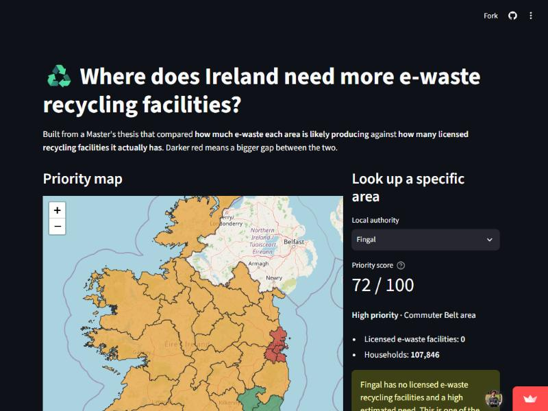

# Waste Infrastructure Gap Recommender

[](https://github.com/Thariiq07/waste-infra-gap-recommender/actions/workflows/ci.yml)

**Turning a Master's thesis into a live, queryable tool.**

**[Open the live dashboard](https://waste-infra-gap-recommender.streamlit.app/)** · [API docs](https://waste-infra-gap-recommender-api.onrender.com/docs)

> The API is on Render's free tier, so if it's been quiet for a while the first request can take 30-50 seconds to wake up — the dashboard will look like it's loading, not broken.

## The problem

Ireland's e-waste recycling infrastructure isn't evenly distributed relative to where waste is actually generated. My Master's thesis — *Multi-Scale Spatial Clustering Framework for E-Waste Infrastructure Planning* (AI & Machine Learning, University of Limerick) — built a data-driven "Underserved Index" across all 3,417 electoral divisions in Ireland to find exactly where that mismatch is worst.

The headline finding: **four local authorities show high e-waste generation potential and zero licensed facilities** — Cork County, Fingal, South Dublin, and Dún Laoghaire-Rathdown.

That analysis lived in a PDF and a set of notebooks. This project turns it into something anyone — a recruiter, a council planner, a researcher — can query and explore live in a browser, instead of reading a report.



## Architecture

```
                 ┌─────────────────┐
   CSO Census    │                  │
   Pobal HP Index│   data/ingest.py │──── cleaned, versioned
   EPA Facilities│  (pipeline)      │     datasets
                 └─────────────────┘
                          │
                          ▼
                 ┌─────────────────┐
                 │  K-Means + SOM   │  clustering &
                 │  clustering      │  cross-validation
                 └─────────────────┘
                          │
                          ▼
                 ┌─────────────────┐        ┌──────────────────┐
                 │   FastAPI (api/) │◄──────►│ Streamlit         │
                 │  /clusters       │        │ dashboard/        │
                 │  /underserved-idx│        │ (interactive map) │
                 │  /local-authority│        └──────────────────┘
                 └─────────────────┘
                          │
                 Dockerized · CI (GitHub Actions)
                 Deployed: API → Render
                           Dashboard → Streamlit Community Cloud
```

## Status

✅ **All 6 weeks shipped — live and deployed.** See [Issues](../../issues) for the week-by-week history.

| Week | Focus | Status |
|---|---|---|
| 1 | Repo scaffold + data ingestion | Done |
| 2 | FastAPI service + tests | Done |
| 3 | Docker + CI/CD | Done |
| 4 | Streamlit dashboard | Done |
| 5 | Deploy API + wire up live dashboard | Done |
| 6 | Polish, docs, demo link | Done |

## Repo layout

```
.
├── api/          FastAPI service (clustering + Underserved Index endpoints)
├── dashboard/    Streamlit app (interactive choropleth map)
├── data/         Ingestion pipeline for CSO / Pobal / EPA datasets
├── tests/        pytest suite for the API and dashboard
└── .github/      CI workflows
```

## Methodology (from the thesis)

- **Data:** CSO Census 2022 (793 raw variables, reduced to the 4 most explanatory), Pobal HP Deprivation Index, EPA Licensed Waste Facility register.
- **Clustering:** K-Means found a clean 3-cluster socioeconomic structure across Ireland's electoral divisions.
- **Validation:** independently cross-checked with a Self-Organizing Map (SOM) built from scratch — the two methods agreed with an Adjusted Rand Index of 0.43, which is what gave confidence to build a real tool on top of the result rather than leave it as a single-algorithm finding.

## Results

The five most underserved local authorities, straight from the live `/underserved-index` endpoint:

| Rank | Local authority | Priority score | Licensed facilities | Households |
|---|---|---|---|---|
| 1 | Dublin City | 82 / 100 | 7 | 225,685 |
| 2 | Cork County | 77 / 100 | 0 | 127,971 |
| 3 | Fingal | 72 / 100 | 0 | 107,846 |
| 4 | South Dublin | 70 / 100 | 0 | 100,364 |
| 5 | Dún Laoghaire-Rathdown | 67 / 100 | 0 | 85,128 |

Dublin City's high score despite having 7 facilities (more than anywhere else) is the thesis's "Dublin City Paradox": its e-waste generation potential is so far ahead of the rest of the country that even its existing facility count doesn't fully close the gap. The other four have zero licensed facilities and real household demand, the clearest gaps the analysis found.

## Live demo

- **Dashboard:** [waste-infra-gap-recommender.streamlit.app](https://waste-infra-gap-recommender.streamlit.app/) — the map, lookup, and full ranking, built for anyone to read.
- **API:** [waste-infra-gap-recommender-api.onrender.com/docs](https://waste-infra-gap-recommender-api.onrender.com/docs) — interactive API docs, for anyone who wants the raw JSON.

Both are free-tier deployments and may take up to a minute to wake up after a period of inactivity.

## Running locally

```
pip install -r requirements.txt
python data/ingest.py          # cleans the raw data into data/processed/
uvicorn api.main:app --reload  # starts the API at http://127.0.0.1:8000
```

Interactive docs at `http://127.0.0.1:8000/docs`. Run `pytest` to run the test suite.

## Running with Docker

```
docker build -t waste-infra-gap-recommender .
docker run -p 8000:8000 waste-infra-gap-recommender
```

Or, for local development with live-reload against your own copy of the code:

```
docker compose up
```

Either way, the API is at `http://localhost:8000/docs` once the container is running. On startup the container cleans the raw data itself, so there's nothing extra to run first.

## Running the dashboard

With the API running (either of the two ways above), in another terminal:

```
streamlit run dashboard/app.py
```

Opens automatically at `http://localhost:8501` — a colour-coded map of all 31 local authorities, a plain-English lookup for any one of them, and the full ranked list. No API knowledge needed to read it. See `dashboard/README.md` for details.

## License

MIT
